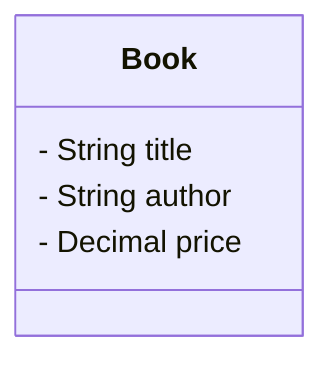
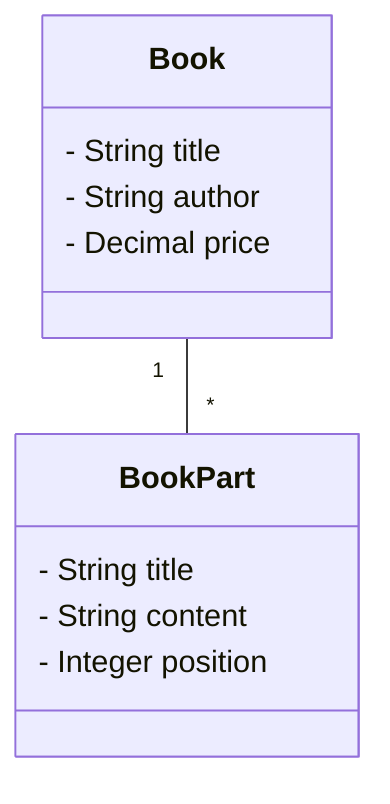
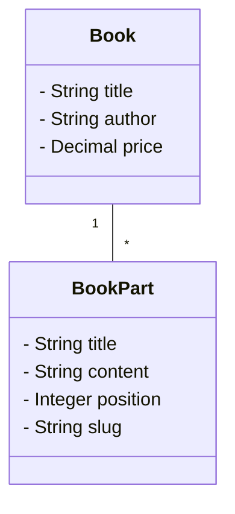
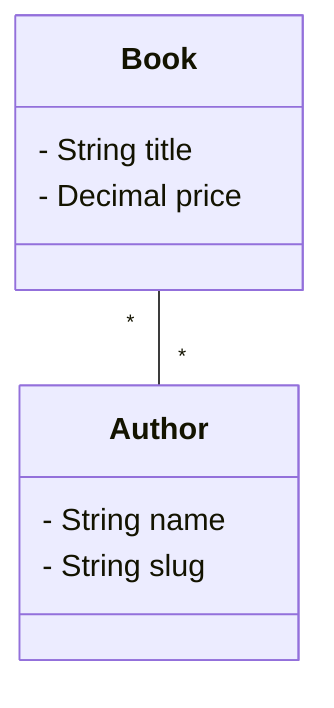
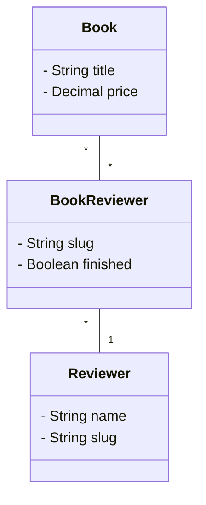
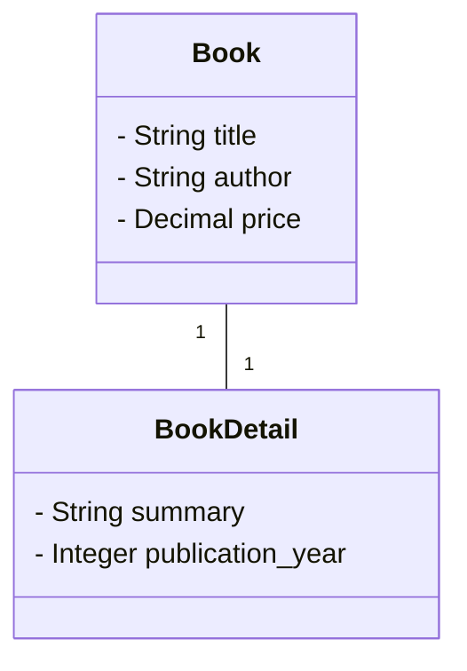
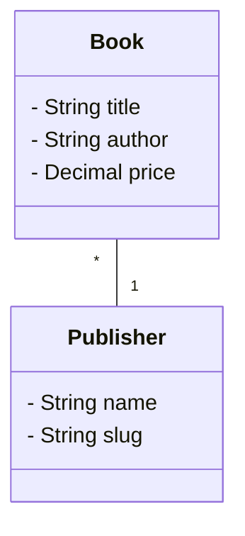
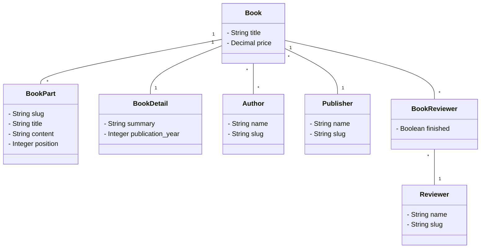

# YamlExporter

**Manage ActiveRecord data in YAML files, track it in Git.**

YamlExporter serializes a record — and everything it owns — to a human-readable YAML file, and imports the file back in a single transaction. A three-method DSL (`attributes`, `one`, `many`) declares the mapping; `yaml_export` and `yaml_import` round-trip the data.

Useful whenever a record is really *content*: seed data, CMS-style entries, training material, quiz banks, fixtures — anywhere you'd rather review changes in a pull request than in the database.

## Installation

Add this line to your application's Gemfile:

```ruby
gem 'yaml_exporter'
```

And then execute:

```
$ bundle install
```

or install it yourself as:

```
$ gem install yaml_exporter
```

## Hello Yaml

Imagine you are a bookstore and want to manage your books in Git.

Here is our model:



Why not create such a file here:

`ruby-on-rails.yaml`
```yaml
title: Ruby on Rails Tutorial
author: Michael Hartl
price: 100
```

Then, you can configure your ActiveRecord model to be able to export and import this data from and to this file:

```ruby
class Book < ActiveRecord::Base
  include YamlExporter

  yaml_structure do
    attributes :title, :author, :price
  end
end
```

Now you can simply import the data from the file into your ActiveRecord model:

```ruby
book = Book.new
yaml_string = File.read('ruby-on-rails.yaml')
book.yaml_import(yaml_string)
```

And of course you can export the data from your ActiveRecord model to the file:

```ruby
yaml_string = book.yaml_export
```

## Mental model

The whole DSL fits in three methods: `attributes`, `one`, and `many`. Everything else is governed by two orthogonal axes and one lifecycle rule.

**A YAML file describes one record and everything it owns.** References (via `find_by`) are how you reach outside that ownership boundary to point at records that live in other trees — other files, or records managed elsewhere in code.

### Axis 1 — cardinality: pick the method

| Method                    | What it describes                   |
| ------------------------- | ----------------------------------- |
| `attributes :col1, :col2` | Plain columns on the current record |
| `one :relation, …`        | Exactly one related record          |
| `many :relations, …`      | A list of related records           |

### Axis 2 — ownership: block vs. `find_by`

The arguments you pass determine both the YAML shape and who owns the record:

| Pattern                        | YAML shape                        | Ownership                                                                                                             |
| ------------------------------ | --------------------------------- | --------------------------------------------------------------------------------------------------------------------- |
| **block**                      | hash                              | **You own it.** YamlExporter creates, updates, and destroys records to match the YAML.                                |
| **`find_by:` only** (no block) | bare string                       | **Someone else owns it.** YamlExporter only resolves the reference — it never creates or destroys referenced records. |
| **block + `find_by:`**         | hash containing the `find_by` key | You own it; identity is a stable column rather than position (for `many`).                                            |

### The combination table

| DSL call                                                              | YAML shape                                                                                         |
| --------------------------------------------------------------------- | -------------------------------------------------------------------------------------------------- |
| `attributes :title, :price`                                           | `title: …`, `price: …`                                                                             |
| `one :book_detail do … end`                                           | nested hash                                                                                        |
| `one :publisher, find_by: :slug`                                      | bare string: `publisher: some-slug`                                                                |
| `many :book_parts do … end`                                           | list of hashes, matched by order                                                                   |
| `many :book_parts, find_by: :slug do … end`                           | list of hashes, matched by `slug`                                                                  |
| `many :book_parts, find_by: :slug, positioned_by: :position do … end` | list of hashes, matched by `slug`; no `position:` key — the column is derived from the array index |
| `many :authors, find_by: :slug`                                       | list of bare strings                                                                               |
| `many :reviewers, through: :book_reviewers, find_by: :slug do … end`  | list of hashes describing join-model attributes                                                    |

### Lifecycle rules

These apply uniformly to every `yaml_import`:

1. **Missing key = `null` = clear it.** Absent attributes are reset to `nil`; absent owned records are destroyed. To tell the importer to ignore a field, omit it from `yaml_structure` — don't leave it blank in the YAML.
2. **One import = one transaction.** If anything raises, the whole import rolls back and the record is left untouched.
3. **Validation failures raise.** All writes go through `save!`, so `ActiveRecord::RecordInvalid` aborts the import. Unresolvable references raise `ActiveRecord::RecordNotFound`. The library deliberately never swallows these.

## Working with relations

The examples below walk through each row of the combination table above, using the same bookstore domain.

### `many` with a block (positional)

Your book consists of multiple parts and on the website you want to display a bit more information about each part:



Of course, you could create a separate yaml file for each book part and pass the book id, but actually it would be nicer to configure the parts in the book yaml file:

```yaml
title: Ruby on Rails Tutorial
author: Michael Hartl
price: 100
book_parts:
  - title: Chapter 1
    content: "This is the first chapter of the book"
    position: 1
  - title: Chapter 2
    content: "This is the second chapter of the book"
    position: 2
```

To do so, configure your book model to have a `has_many` relation to book parts:

```ruby
class Book < ActiveRecord::Base
  has_many :book_parts, dependent: :destroy

  include YamlExporter

  yaml_structure do
    attributes :title, :author, :price
    many :book_parts do
      attributes :title, :content, :position
    end
  end
end
```

**Edge cases**:
* If there are missing book parts in the database, they will be created.
* If the database has more book parts than in the yaml file, the extra book parts will be deleted.
* Existing rows are matched by array index — so re-ordering the list silently overwrites each row with another row's data.

Be aware that this way you need to be very careful with the order of the book parts in the yaml file. To avoid this, you can use the `find_by` option:

### `many` with `find_by` and a block

Let us now identify the book parts by a stable column, for example, let's add a `slug` column to the book parts:



Now you can configure your book model to identify the book parts by the `slug` column:

```ruby
class Book < ActiveRecord::Base
  has_many :book_parts, dependent: :destroy

  include YamlExporter

  yaml_structure do
    attributes :title, :author, :price
    many :book_parts, find_by: :slug do
      attributes :title, :content, :position
    end
  end
end
```

The corresponding yaml file would look like this:

```yaml
title: Ruby on Rails Tutorial
author: Michael Hartl
price: 100
book_parts:
  - slug: chapter-1
    title: Chapter 1
    content: "This is the first chapter of the book"
    position: 1
  - slug: chapter-2
    title: Chapter 2
    content: "This is the second chapter of the book"
    position: 2
```

**Identification**: YamlExporter uses `book.book_parts.find_by(slug: "chapter-1")` to identify each book part. Slugs do not need to be unique across all books; and if multiple book parts for the same book share a slug, only the first is matched and the rest are deleted.

**Edge cases**:
* Missing book parts in the database will be created.
* Extra book parts in the database (absent from the yaml) will be deleted.
* The order of the book parts in the yaml file doesn't matter for *identity* — but `position: 1`/`position: 2` is still being managed by hand.
 
The next section shows how to make the YAML order itself drive the `position` column.

### `many` with `positioned_by:` (derived position)

The previous example stores `position` as a regular column and requires the user to keep the numbers in sync with the list order. That's both tedious and a constant source of merge conflicts.

`positioned_by:` hands that column to YamlExporter: on import, each entry's position is set from its 1-based array index; on export, the list is sorted by the position column ASC and the column is omitted from the YAML (the order of the list **is** the position).

```ruby
class Book < ActiveRecord::Base
  has_many :book_parts, dependent: :destroy

  include YamlExporter

  yaml_structure do
    attributes :title, :author, :price
    many :book_parts, find_by: :slug, positioned_by: :position do
      attributes :title, :content
    end
  end
end
```

The YAML gets tidier — no `position:` keys inside the entries:

```yaml
title: Ruby on Rails Tutorial
author: Michael Hartl
price: 100
book_parts:
  - slug: chapter-1
    title: Chapter 1
    content: "This is the first chapter of the book"
  - slug: chapter-2
    title: Chapter 2
    content: "This is the second chapter of the book"
```

Reordering is now a single-line move in the YAML file, and the `position` column in the database tracks it automatically.

**Edge cases**:
* The `positioned_by:` column may **not** also appear in the block's `attributes` list — the DSL owns it for the owned record. Declaring both raises at load time.
* A `position:` key (or whatever column you named) inside a YAML entry is rejected on import, for the same reason.
* If the database has gaps, duplicates, or `NULL`s in the position column from earlier code paths, a full import rewrites them 1..N cleanly. The YAML is always the source of truth.
* `positioned_by:` is available wherever there is an owned record to write the column onto — so with or without `find_by:`, and also in combination with `through:` (where the column lives on the join model, same as other block attributes). It is **not** available on `many :authors, find_by: :slug` (no block), since there is no owned record.

### `many` with `find_by` and no block (reference list)

Sometimes the children of a `has_many` are not owned by the parent at all — they are managed elsewhere (in their own yaml files, or by the user directly), and the parent only needs to reference them. The prime example is a many-to-many relation. Say authors are their own records and a book just points at them:



Since `has_and_belongs_to_many` has no join-model attributes to manage, it fits this pattern exactly — so the example below uses HABTM to demonstrate. Drop the block entirely and use `find_by` to declare the key:

```ruby
class Book < ActiveRecord::Base
  has_and_belongs_to_many :authors

  include YamlExporter

  yaml_structure do
    attributes :title, :price
    many :authors, find_by: :slug
  end
end
```

Because the block is missing, each author appears in the YAML as a bare string (the slug), not a hash:

```yaml
title: Ruby on Rails Tutorial
price: 38
authors:
  - michael-hartl
  - another-author
```

This same flavor works for `has_and_belongs_to_many` (as above) and for any `has_many` where the parent shouldn't manage the children's attributes.

**Identification**: YamlExporter uses `Author.find_by(slug: "michael-hartl")` to resolve each entry.

**Edge cases**:
* If a referenced author does not exist in the database, `ActiveRecord::RecordNotFound` is raised — the library never auto-creates referenced records.
* If the database has more associations than the yaml file, the extra associations are removed — for HABTM only the join rows are removed, the referenced records themselves are left untouched.
* The order of the entries in the yaml file doesn't matter.

### `many` with `through:` (has_many :through with join attributes)

`has_many :through` is not a separate DSL method — how you expose it depends on whether the join model carries its own attributes.

**If the join has no extra attributes** it behaves like HABTM — declare the target association as a reference list (see above).

**If the join carries its own attributes** (e.g. `finished` on a `book_reviewers` join), declare `many` on the `:through` target and pass both `through:` and `find_by:`. The block then describes attributes of the **join model**:



```ruby
class Book < ActiveRecord::Base
  has_many :book_reviewers, dependent: :destroy
  has_many :reviewers, through: :book_reviewers

  include YamlExporter

  yaml_structure do
    attributes :title, :price
    many :reviewers, through: :book_reviewers, find_by: :slug do
      attributes :finished # lives on book_reviewers, the join model
    end
  end
end
```

```yaml
title: Ruby on Rails Tutorial
price: 100
reviewers:
  - slug: alice
    finished: true
  - slug: bob
    finished: false
```

On import, each entry is processed like this:

1. Find the `Reviewer` by slug. (`Reviewer.find_by(slug: "alice")`)
2. Find-or-build the `book_reviewer` join row linking this book and that reviewer — the identity of the join is `(book_id, reviewer_id)`, so no positional matching is needed. (`book.book_reviewers.find_or_create_by(reviewer_id: reviewer.id)`)
3. Apply the block's attributes (`finished`) to the join row.
4. Destroy any join rows whose reviewer is no longer listed.

`positioned_by:` works here too — the column lives on the join model, so e.g. `many :reviewers, through: :book_reviewers, find_by: :slug, positioned_by: :position do … end` makes the YAML order drive `book_reviewers.position`.

The alternative — declaring `many` directly on the **join model itself** — is also supported and useful when you want to expose the join row as its own first-class concept rather than hiding it behind the target association.

### `one` with a block (owned)

This is the `has_one` pattern. Suppose every book has exactly one `book_detail` containing extra information like a summary and publication year:



Let's configure your models for this:

```ruby
class Book < ActiveRecord::Base
  has_one :book_detail, dependent: :destroy

  include YamlExporter

  yaml_structure do
    attributes :title, :author, :price
    one :book_detail do
      attributes :summary, :publication_year
    end
  end
end

class BookDetail < ActiveRecord::Base
  belongs_to :book
end
```

Your YAML file would look like:

```yaml
title: Ruby on Rails Tutorial
author: Michael Hartl
price: 100
book_detail:
  summary: "A practical introduction to Ruby on Rails development."
  publication_year: 2022
```

**Identification**: YamlExporter uses `book.book_detail` to follow the association. There can only be one book detail per book.

**Edge cases**:
* If there is no book detail in the database, it will be created.
* If the `book_detail:` key is missing from the YAML or set to `null`, the existing book detail is destroyed — omission and `null` are treated the same. If that violates a model-level validation (e.g. `book_detail` is required), the resulting `ActiveRecord` error propagates and the whole import is rolled back.

### `one` with `find_by` (reference)

This is the `belongs_to` pattern. A book is published by a publisher — the book has the `publisher_id` foreign key, and the publisher is a first-class record managed in its own YAML file elsewhere.



We could dump the `publisher_id` column to the book yaml, but that's brittle and not human-friendly. Instead we reference the publisher by a stable column:

```ruby
class Book < ActiveRecord::Base
  belongs_to :publisher

  include YamlExporter

  yaml_structure do
    attributes :title, :author, :price
    one :publisher, find_by: :slug
  end
end
```

Our yaml file now looks like this:

```yaml
title: Ruby on Rails Tutorial
author: Michael Hartl
price: 100
publisher: addison-wesley
```

**Identification**: YamlExporter uses `Publisher.find_by(slug: "addison-wesley")` to resolve the publisher. If several publishers share the slug, only the first match is used.

**Edge cases**:
* If no publisher matches the slug in the database, `ActiveRecord::RecordNotFound` is raised.

**Two restrictions apply**, both following from the ownership model:

* `find_by` is **required** for a reference-flavored `one`. Without it, the only alternative would be exposing the raw foreign key (`publisher_id`) in the YAML using the `attributes` method.
* A block is **not allowed** when `find_by` is given. The publisher owns itself — a book is just one of many records pointing at it — so the book's YAML has no business defining the publisher's attributes. Manage the publisher from its own YAML file instead.

## Putting it all together

Let us now put all together:

```ruby
class Book < ActiveRecord::Base
  has_many :book_parts, dependent: :destroy
  has_one :book_detail, dependent: :destroy
  has_and_belongs_to_many :authors
  belongs_to :publisher
  has_many :book_reviewers, dependent: :destroy
  has_many :reviewers, through: :book_reviewers

  include YamlExporter

  yaml_structure do
    attributes :title, :price
    many :book_parts, find_by: :slug, positioned_by: :position do
      attributes :title, :content
    end
    one :book_detail do
      attributes :summary, :publication_year
    end
    many :authors, find_by: :slug
    one :publisher, find_by: :slug
    many :reviewers, through: :book_reviewers, find_by: :slug do
      attributes :finished
    end
  end
end
```

Our yaml file now looks like this:

```yaml
title: Ruby on Rails Tutorial
price: 100
book_parts:
  - slug: chapter-1
    title: Chapter 1
    content: "This is the first chapter of the book"
  - slug: chapter-2
    title: Chapter 2
    content: "This is the second chapter of the book"
book_detail:
  summary: "A practical introduction to Ruby on Rails development."
  publication_year: 2022
authors:
  - michael-hartl
  - another-author
publisher: addison-wesley
reviewers:
  - slug: alice
    finished: true
  - slug: bob
    finished: false
```

And the resulting object graph:



## Behaviors of `yaml_import` and `yaml_export`

`yaml_import` and `yaml_export` are instance methods included in the model. So if you want to import a model from a yaml file, you first find or create an object and then call `yaml_import` on it:

```ruby
book = Book.new
book.yaml_import(File.read('ruby-on-rails.yaml'))
```

And of course you can export the data from your ActiveRecord model to the file:

```ruby
yaml_string = book.yaml_export
```

We prefer to identify the objects by the filename of the file and a slug field. So if you have a directory `books` you can import all files in the directory with:

```ruby
Dir.glob('books/*.yaml').each do |file|
  book = Book.find_or_create_by(slug: File.basename(file, '.yaml'))
  book.yaml_import(File.read(file))
end
```

**Import edge cases** (apply to every `yaml_import`, in addition to the lifecycle rules in the [mental model](#lifecycle-rules)):

* Duplicate keys inside the same YAML list — e.g. two `slug: chapter-1` entries under one `book_parts:` — raise an error. Each `find_by` key must be unique within its list.
* Missing / `null` clears not just plain `attributes` columns, but also `one` references (the foreign key is cleared) and `one` owned children (the child is destroyed).

**Export behavior** (mirrors the import rules):

* `nil` round-trips as YAML `null`. A `nil` column is emitted as `null`; a missing `one` reference is emitted as `<key>: null`; an absent owned `one` is emitted as `<key>: null` too.
* The output is a plain YAML document, without a leading `---` marker.
* Lists are written in a stable, diff-friendly order. The rule is: take the first rule that applies, top to bottom:
  1. `many` with `positioned_by:` → sorted by the position column ASC; the column itself is omitted from each entry's hash.
  2. `many` with `find_by:` (with or without a block, including the `through:` variant, without `positioned_by:`) → sorted by the `find_by` column so adding or removing an entry only touches its own line in Git diffs.
  3. `many` with a block only (no `find_by:`) → the collection's SQL order, which is the order the children were inserted (this is also the order positional matching relies on).

## API reference

All DSL methods are declared inside a `yaml_structure do … end` block on the model. Inside the block, `attributes`, `one` and `many` are resolved against a builder — they never clash with ActiveRecord's own class-level methods (e.g. `attribute`, `has_one`).

### `attributes(*names)`

Columns of the model that are serialized and deserialized. Missing keys in the YAML reset the corresponding columns to `nil` on import.

### `one(name, find_by: nil, &block)`

A single related record. Exactly one of `find_by:` or a block must be given:

| Call                         | YAML shape  | Meaning                                                             |
| ---------------------------- | ----------- | ------------------------------------------------------------------- |
| `one :child do … end`        | nested hash | Owned child (the `has_one` pattern).                                |
| `one :child, find_by: :slug` | bare string | Reference to a record managed elsewhere (the `belongs_to` pattern). |

Passing both a block and `find_by:` is rejected — see the ownership reasoning in [`one` with `find_by`](#one-with-find_by-reference).

### `many(name, positioned_by: nil, find_by: nil, through: nil, &block)`

A list of related records. The flavor is picked from the combination of `positioned_by:`, `find_by:`, `through:` and a block:

| Call                                                                             | YAML shape                                      | Meaning                                                                                                         |
| -------------------------------------------------------------------------------- | ----------------------------------------------- | --------------------------------------------------------------------------------------------------------------- |
| `many :children do … end`                                                        | list of hashes, matched by order                | Children fully managed, identity by position.                                                                   |
| `many :children, positioned_by: :position do … end`                              | same as above, without `position:` in each hash | Like the previous row, but the position column is derived from the 1-based array index (and omitted on export). |
| `many :children, find_by: :slug do … end`                                        | list of hashes containing the `slug:` key       | Children fully managed, identity by a stable column.                                                            |
| `many :children, find_by: :slug, positioned_by: :position do … end`              | same as above, without `position:` in each hash | Like the previous row, but the named column is derived from the 1-based array index (and omitted on export).    |
| `many :children, find_by: :slug`                                                 | list of bare strings                            | Children referenced by key, managed elsewhere (HABTM pattern).                                                  |
| `many :children, through: :joins, find_by: :slug do … end`                       | list of hashes containing the `slug:` key       | `has_many :through` where the block describes attributes of the **join model**.                                 |
| `many :children, through: :joins, find_by: :slug, positioned_by: :position do …` | same as above, without `position:` in each hash | As above, with the position column derived on the **join model**.                                               |

`positioned_by:` requires a block – there must be an owned record to write the column onto – and therefore cannot be used with the reference-list flavor of `many`.

### Import / export

* `instance.yaml_import(yaml_string)` — updates `instance` in place from the YAML, inside a single transaction. Returns the instance.
* `instance.yaml_export` — returns a YAML string for `instance` following its `yaml_structure`.

### `ModelClass.yaml_schema`

Returns a JSON-schema-like hash describing the YAML shape declared by `yaml_structure`. Useful for generating editor support or validating YAML out-of-band. Invalid YAML passed to `yaml_import` raises with a message pointing at the violated part of the schema.

## Development

Run the test suite with:

```
$ bundle exec rake test
```
